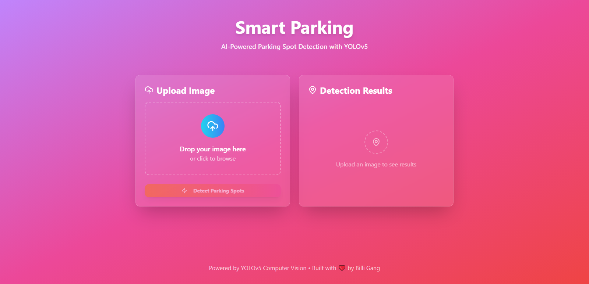

# Smart Parking - AI Powered Parking Spot Detection with YOLOv5

### Artificial Intelligence Lab - 6th Semester BSCS
### Term Project

This project presents an AI-powered parking spot detection system built using YOLOv5 object detection. The system enables automated detection of available parking spots from parking lot images, providing the foundation for smart parking solutions in real-world scenarios.

## Tools & Technologies

- **YOLOv5** — Computer Vision Object Detection Model
- **Python** — Backend development
- **FastAPI** — REST API for detection service
- **PIL (Pillow)** — Image processing
- **React.js (Vite)** — Frontend interface
- **ShadCN UI Library** — Frontend components
- **makesense.ai** — Dataset labeling

## Dataset & Training Details

The project's goal was to demonstrate the complete end-to-end workflow from data labeling to model training and application development.

- Parking lot images were obtained from the [CNRPark + EXT dataset](http://cnrpark.it/)
- A limited subset of images was labeled manually using [makesense.ai](https://www.makesense.ai/)
- Trained weights are included in the repo (`best.pt`)

## How to Run

### 1. Clone the Repository
```bash
git clone https://github.com/Wahab3917/Smart-Parking.git
cd Smart-Parking
```

### 2. Backend Setup
```bash
cd backend
pip install -r requirements.txt
```

Start the backend server:
```bash
uvicorn main:app --reload --host 0.0.0.0 --port 5000
```

### 3. Frontend Setup
```bash
cd frontend
npm install
```

Start the frontend server:
```bash
npm run dev
```

## Screenshot

<div>
  
</div>

